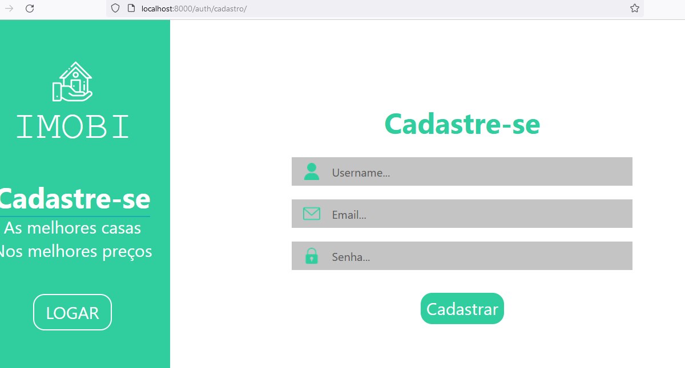
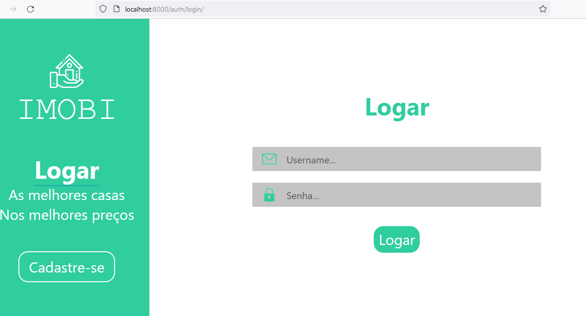
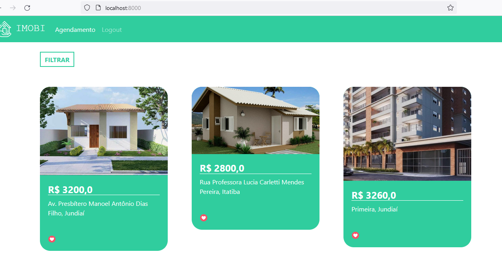
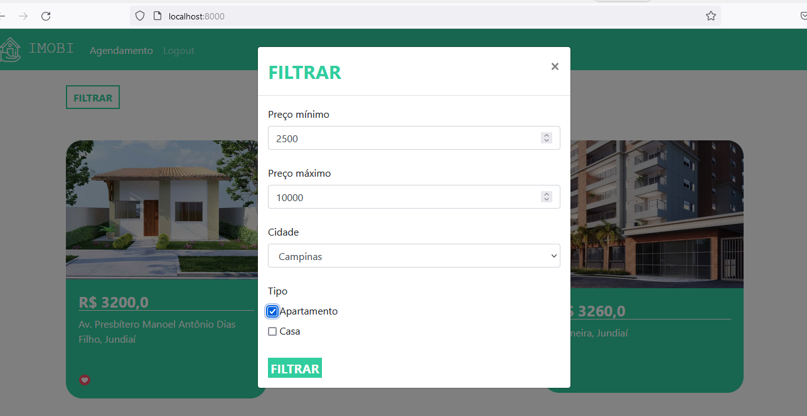
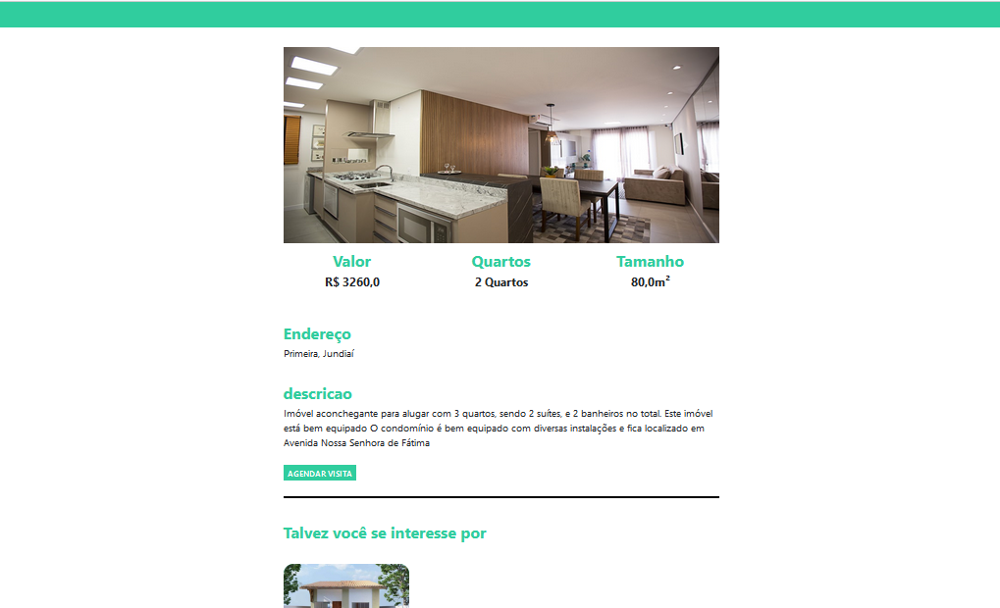
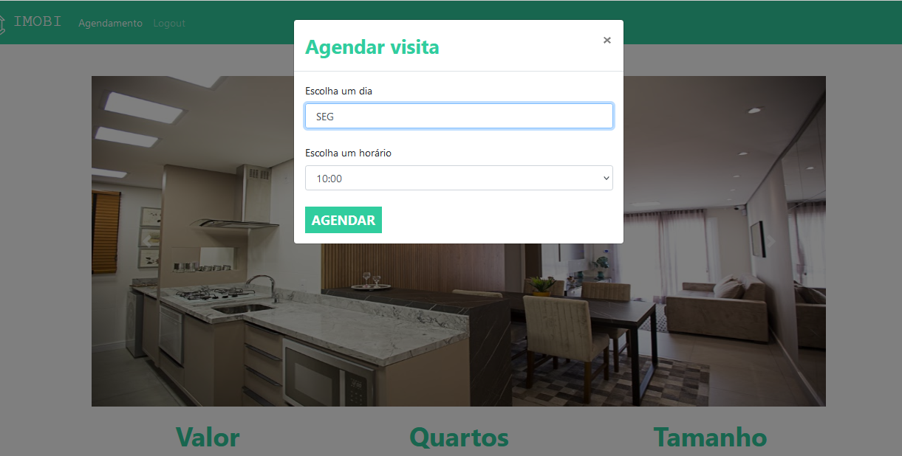
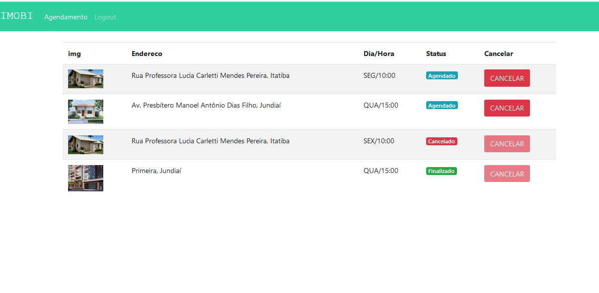

# RealState - Django Project

## Simple system to manage real state. You can register houses, someone can apply to visit the house. Once it is done, you can change the visit status, house status

### You can:

###### - Signup

###### - Signin

###### - List houses is status ok for visit

###### - See details of each house

###### - Apply to visit a house

###### - Filter the houses listing by min price, max price, city and type

###### - Using the admin platform, the contractor can change the house status to not disponible

---

To run the project you need to have [Python](https://www.python.org/downloads/).

Create a directory to the project and inside of it run this in cmd to create a virtual environment:
`python -m venv venv`

Now you need to activate the virtual environment. If you are under Linux or Mac run in cmd:
`source /venv/bin/activate`

If you are under windows run this in cmd:
`/venv/bin/activate.bat`

Once it is done, run in cmd:
`pip install -r requirements.txt`

In the root directory you have `.env copy`. Rename it to `.env` and put a key in the SECRET_KEY field.

To run the project:
`python manage.py runserver`

To create a super user:
`python manage.py createsuperuser`

To enter the admininstration of the app, in the browser enter:
`http://127.0.0.1/admin/`

Enter the user you created in the step before.

In the cmd run this command to create the tables in database:
`python manage.py migrate`

---

Tiago Mendes
tetigo@gmail.com
